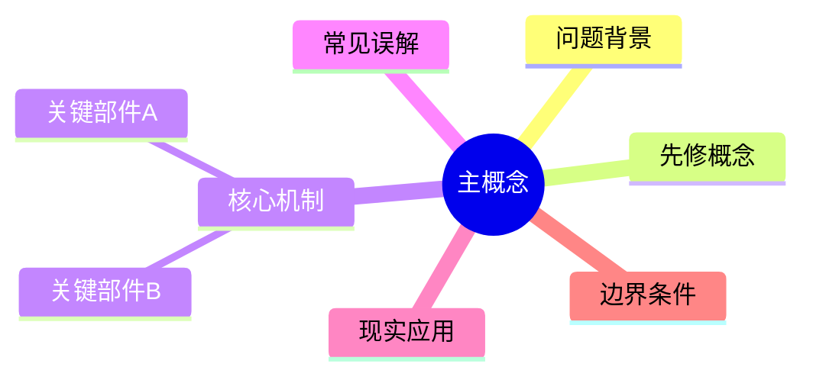

# Concept Tree Reference

用于“知识树、概念树、先修知识、结构图、Mermaid、脑图、学习路径”等请求。目标是帮用户从“听懂一句”推进到“知道这个概念挂在哪棵树上”。

## Tree Rules

- 控制在 5-8 个节点，不生成百科式大树。
- 根节点是用户关心的主概念。
- 子节点优先覆盖：问题背景、先修概念、核心机制、关键部件、常见误解、现实应用、边界条件。
- 每个节点包含一句定义和一句生活化解释。
- 节点之间必须有父子关系，不只是一组关键词。

## Default Markdown Tree

```markdown
### [主概念] 的知识树

- [主概念]：一句话说明它解决什么问题。
  - 问题背景：[为什么需要它]
  - 先修概念：[理解它之前要知道什么]
  - 核心机制：[它真正怎么运转]
    - 关键部件 A：[作用]
    - 关键部件 B：[作用]
  - 常见误解：[最容易想错的点]
  - 现实应用：[在哪里会用到]
  - 边界条件：[什么时候会失效或变形]
```

## Mermaid Mode

只有用户明确要求 Mermaid、流程图或可渲染图时，输出 Mermaid。



## Deep Follow-Up

在知识树后提供 2-3 个后续追问，帮助用户继续钻：

- “如果拿掉 [关键部件]，整个机制会在哪里崩？”
- “[主概念] 和 [相近概念] 最容易混淆的边界是什么？”
- “现实系统里，人们通常在哪个环节误用它？”
